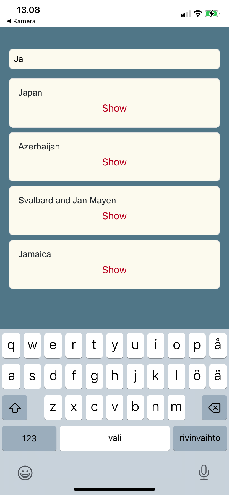
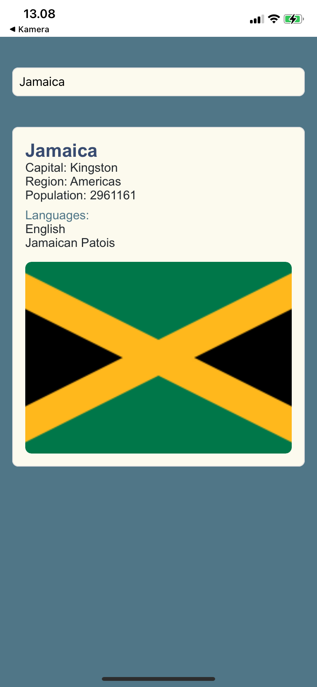

# React Native

Työstämäni sovellus opinnäytetyötä varten, jonka aiheena React Native. Teen puhelinsovelluksen, josta voi hakea eri maita ja nähdä niiden perustiedot, kuten mitä kieltä maassa puhutaan, maan lipun ja asukasluvun jne. Näkymään tulee myös kartta josta näkee maan sijainnin. Myös maan pääkaupungin säätiedot näytetään. Lopuksi ajattelin julkaista sovelluksen App Storeen sekä Google Play Storeen.

Maiden hakuun käyttämäni API: https://studies.cs.helsinki.fi/restcountries/
Säätietojen hakuun käyttämäni API: https://openweathermap.org/

Sovelluksen käyttöliittymä on yksinkertainen.
Näytettävä maa haetaan kirjoittamalla hakuehto hakukenttään.
Jos ehdon täyttäviä maita on liikaa (yli kymmenen), kehotetaan tarkentamaan hakuehtoa.
Jos maita on kymmenen tai alle mutta enemmän kuin yksi, näytetään hakuehdon täyttävät maat.

Kun ehdon täyttäviä maita on enää yksi, tai käyttäjä valitsee listalta tarkasteltavan maan, näytetään yksittäisen maan näkymä jossa näkyy laajasti maan eri tiedot, lippu ja sijainti kartalle yms.

