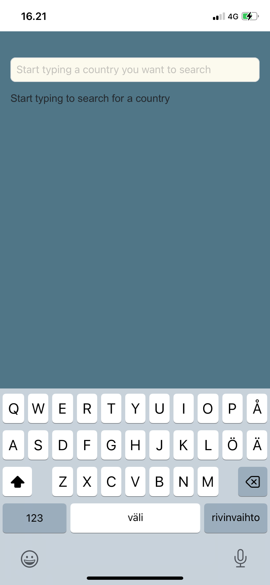
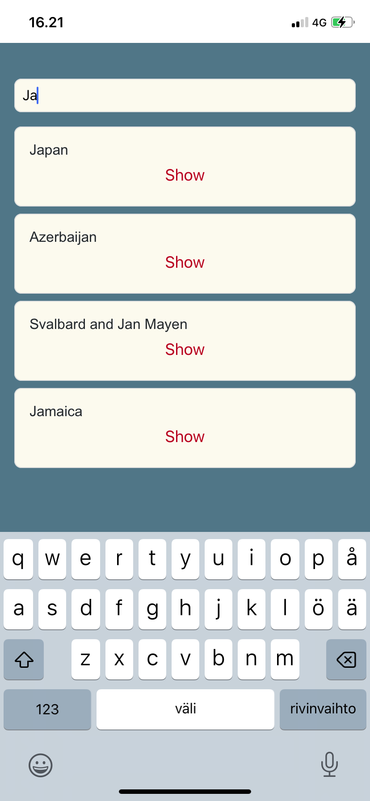
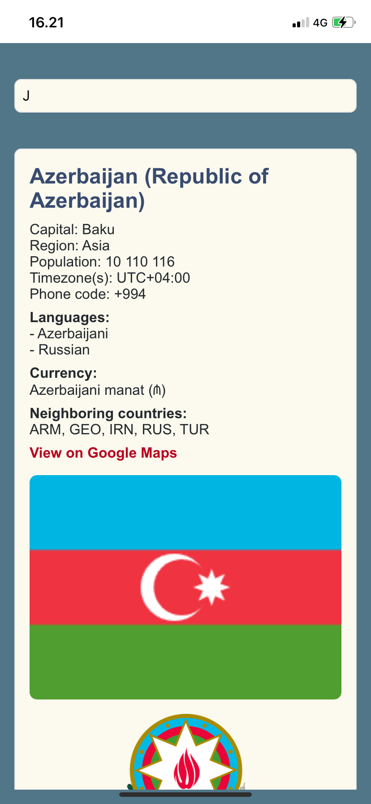
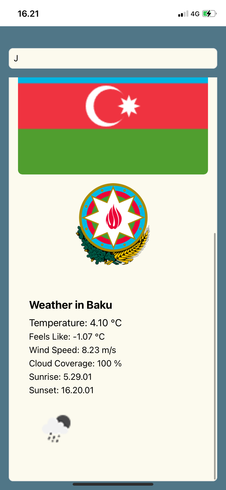
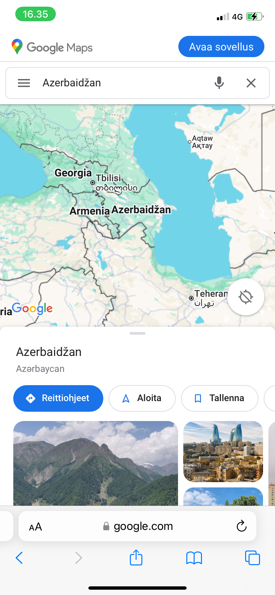

# React Native

Työstämäni sovellus opinnäytetyötä varten, jonka aiheena React Native. Sovelluksessa voi hakea eri maita ja nähdä niiden perustiedot, kuten mitä kieltä maassa puhutaan, maan lipun sekä vaakunan ja asukasluvun jne. Näkymässä on myös linkki google mapsiin, joka näyttää suoraan maan sijainnin kartalla. Myös maan pääkaupungin säätiedot näytetään. Sovellus on muutoin valmis, tarkoituksena vielä julkaista se App Storeen sekä Google Play Storeen jos ylimääräistä aikaa jää opparin loppuvaiheessa.

Maiden hakuun käyttämäni API: https://studies.cs.helsinki.fi/restcountries/
Säätietojen hakuun käyttämäni API: https://openweathermap.org/

Sovelluksen käyttöliittymä on yksinkertainen.
Näytettävä maa haetaan kirjoittamalla hakuehto hakukenttään.
Jos ehdon täyttäviä maita on liikaa (yli kymmenen), kehotetaan tarkentamaan hakuehtoa.
Jos maita on kymmenen tai alle mutta enemmän kuin yksi, näytetään hakuehdon täyttävät maat.

Kun ehdon täyttäviä maita on enää yksi, tai käyttäjä valitsee listalta tarkasteltavan maan, näytetään yksittäisen maan näkymä jossa näkyy laajasti maan eri tiedot, lippu ja sijainti kartalle yms.

Lyhyt esittely video sovelluksen käytöstä: https://www.youtube.com/shorts/vu57qgLhZ_M

